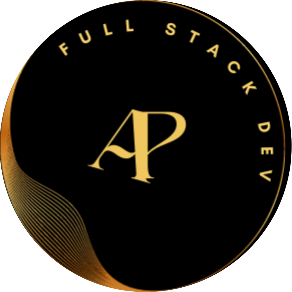
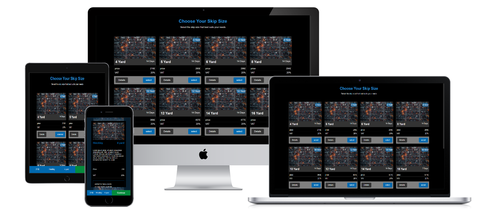

  
   
  <h1><b>Skip Page REM Waste</b>  </h1>
 

  <h1>App Mock</h1>
  
  

 
 
 
<!-- TABLE OF CONTENTS -->

# 📗 Table of Contents

- [📖 About the Project](#about-project)
  - [🧪 Linters And test](#linters)
  - [🛠 Built With](#built-with)
    - [Tech Stack](#tech-stack)
    - [Key Features](#key-features)
  - [🚀 Live Demo](#live-demo)
- [💻 Getting Started](#getting-started)
  - [Setup](#setup)
  - [Prerequisites](#prerequisites)
  - [Install](#install)
  - [Usage](#usage)
  - [Run tests](#run-tests)
  - [Deployment](#triangular_flag_on_post-deployment)
- [👥 Authors](#authors)
- [🔭 Future Features](#future-features)
- [🤝 Contributing](#contributing)
- [⭐️ Show your support](#support)
- [🙏 Acknowledgements](#acknowledgements)
- [🧑‍💻 Credits ](#credit)
- [📝 License](#license)

<!-- PROJECT DESCRIPTION -->

# 📖 REM Waste Skip Page 
**REM Waste Skip Page** Welcome to the REM Waste Skip Page! 
here you can see the details of the skip, price and resources we are offering
 

## 🧪 Linters And test 

## 🛠 Built With 

### Tech Stack 

> In this project I used many skills, tech and libraries

  
Markup

  <ul>
    <li><a href="https://html.com">HTML</a></li>
  </ul>

  
Styling

  <ul>
    <li><a href="https://sass-lang.com/">SASS</a></li>
  </ul>

 

<!-- Features -->

### Key Features 

> Following features you should observe

- **you can see various skips listed on home page**
- **You can  see the pop up details**
- **you can see and select the skip**
- **based on selection continue overlay displayed**

(<a href="#readme-top">back to top</a>)

<!-- GETTING STARTED -->

## 💻 Getting Started 

>For having local file and project you can fork this repo 

>And for making changes you you should follow prerequisites

### Prerequisites
To edit this project you need:
 - Node.js installed
 - A Terminal 
 - A web browser
 - An IDE

 - suggested IDE
   - visual studio code
   - atom 
   - visual code 

### Setup

Clone this repository to your desired folder:

 - And run `npm i` in root dir <small>to install node modules</small>
 - Then run `npm run dev` or `npm start`
 - All this makes our project open  in the browser

### Usage

 Execute the following thing:
 
- Select Skip based on price

### Run tests And Linter

- To run all test cases you need to run `npm run test` in the root dir 
- Linters for files run in the root dir
  - `npx eslint "**/*.{js,jsx}` for JS or JSX linting
  - `npx stylelint "**/*.{css,scss}"`for CSS or SCSS linting
  - `--fix` flag for instant fixable fix
 

### Deployment

You can deploy this project using:
- Fork our Repo and clone it or download `zip` and extract it
- Edit some changes
- Run `npm run build` to make our project production ready
- deploy it using [GitHub](www.github.com) pages 
- or use Netlify or Render
 

(<a href="#readme-top">back to top</a>)

<!-- AUTHORS -->

## 👥 Authors 

👤 **Adarsh Pathak**

- GitHub: [@PowerLevel9000](https://github.com/githubhandle)
- Twitter: [@PowerLevel9002](https://twitter.com/PowerLevel9002?t=AIuSN7mTxk5a_MWpLolEjA&s=09)
- LinkedIn: [@Adarsh Pathak](https://www.linkedin.com/in/adarsh-pathak-56a831256/)

<!-- FUTURE FEATURES -->

## 🔭 Future Features 

> Description 1 - 3 features that will be added to the project.

- [ ] **Search Feature**
- [ ] **Grind an list theme listing**
- [ ] **Stats chart of skip selected like skip handling efficiency and management**

(<a href="#readme-top">back to top</a>)

<!-- CONTRIBUTING -->

## 🤝 Contributing 

Contributions, issues, and feature requests are welcome!

Feel free to check the [issues page](https://github.com/PowerLevel9000/skip-page-rem-waste/issues).

(<a href="#readme-top">back to top</a>)

<!-- SUPPORT -->

## ⭐️ Show your support 

If you like my Project give it a Star ✨🌟
or
 

(<a href="#readme-top">back to top</a>)

<!-- LICENSE -->

## 📝 License 

This project is [MIT](./LICENSE) licensed.

(<a href="#readme-top">back to top</a>) 
